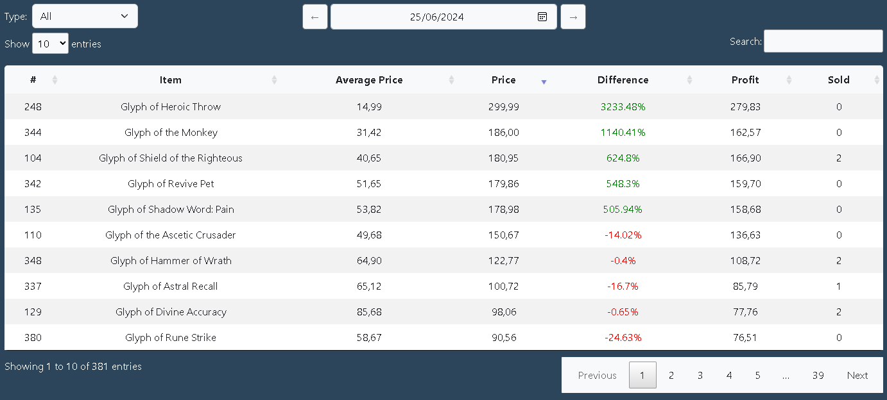
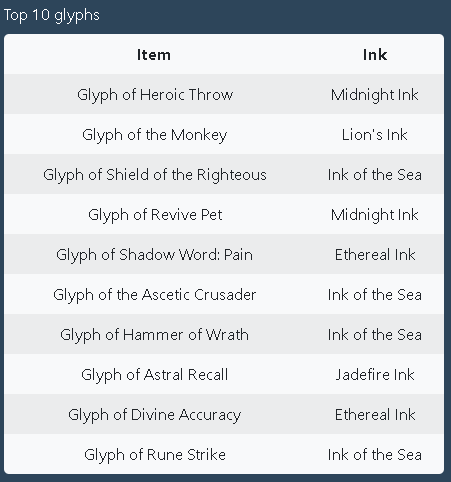
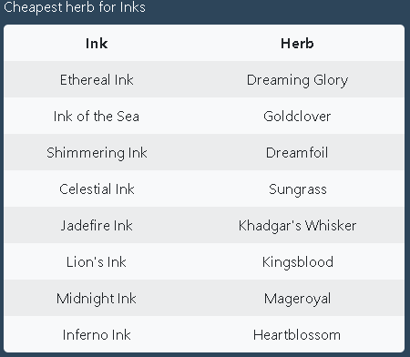
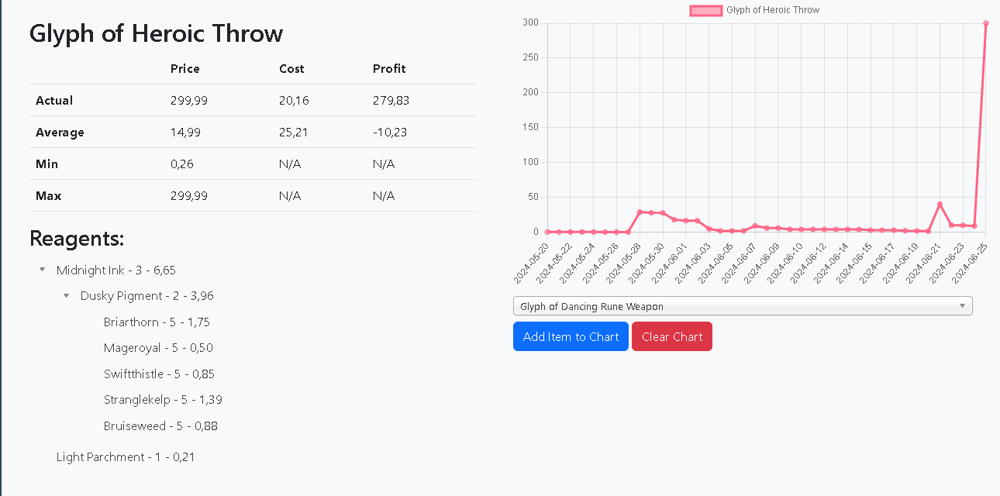
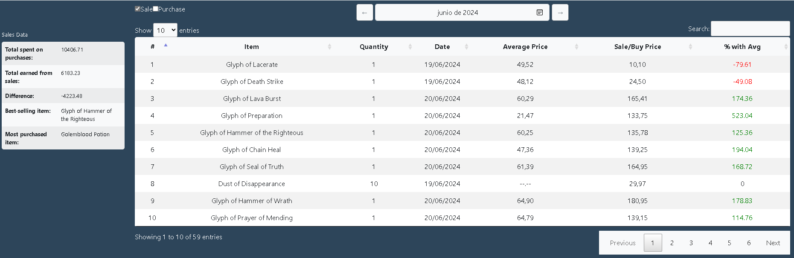

## INTRODUCTION

This is a helper dashboard for World of Warcraft Inscription profession. 

### What do you need to know if you don´t know world of warcraft:
* players have professions.
* professions can be used to craft and sell common trade goodies in a marketplace.
* this particular profession have 350+ different items  called **Glyphs**.
* Glyphs are crafted using **inks** which in turn are crafted using **Herbs** that can be harvested or bought.

___

### This leaves us with the following problematic:

**1. What are the most expensive Glyphs that i can craft?**  
**2. What are the inks that i need for such glyphs?**  
**3. What are the cheapest herbs that i can buy to craft said inks?**  

This project answers such questions easily and provide us with useful indicators.

## FEATURES:

### On Main Page:
* Daily dataTables with fields for current price, average price, difference with yesterday and profit from selling said items.

* side table with the top 10 most expensive Glyphs available for sale and which ink is needed for crafting.
.
* side table that shows what is the cheapest Herb on the market for each ink (multiple herbs can be used to craft the same ink).
* 
___

### On Items Page:
* Table with Min, Max, AVG and current Data.
* Recursive reagent tree displaying reagent, number of them  needed and individual price.
* Line chart displaying the evolution of price over time.
 
___

### On Sales Page:
* Monthly table with all the transactions with fields for item, date, price, quantity, AVG price and % with AVG **(Anything bought over AVG or sold below AVG will be flagged as red. Likewise anything bought below AVG or sold above AVG will be marked as green)**
* Aside table with General sales data.

___

## REQUIREMENTS:
* A database manager [i use HeidiSQL](https://www.heidisql.com/download.php).
* A local server that can run PHP [i use XAMPP](https://www.apachefriends.org/es/index.html).
* World of warcraft ( You know where to find it).
* [Auctionator](https://www.curseforge.com/wow/addons/auctionator).
___
## INSTALLATION:
 **FOR MAIN PANEL AND ITEMS PAGE ONLY**
* Download the project  from release.
* Execute wowscrap.sql Database query. This will have included prices and items up untill 25.06.2024.
* Open live server and go!
___
**FOR SALES/PURCHASES DATA**
* You need aswell to download and install a World of warcraft addon to register all the sales/purchases from your in-game Mail  [AipoxMailLedger](https://github.com/Aperezortega/wowMailLedger).

## HOW DOES IT WORK AND HOW DO I USE IT?

First and all we need to understand how does the program works before using it.

### For price data:
The workflow starts by us scanning the prices of the  Auction House using a shopping list. For this we need the in-game auctionator addon.  
This addon includes a feature called **"Shopping Lists"** which can scan multiple items at once and let us copy the output into our file **export.csv**  
I have included a file with my auctionator Shopping list in this project.
___

After this step is done, we need to execute insertExport.php script. Can do this using vscode terminal.
~~~~~
>>cd scripts
>>php insertExport.php
~~~~~

What this script will do is open the file export.csv and will go throught every line and insert the item into the database and if the item does not exist, it will execute the script wowhead.php.  This will scrap wowhead´s page and will find the reagents needed to craft this particular item and insert the info into architecture table. This is needed for the Reagent tree and in order to calculate the crafting costs.

This will be all for the prices section.
___

### For sales data:
With the addon i have created installed [AipoxMailLedger](https://github.com/Aperezortega/wowMailLedger). the solution i have come with is to create a .bat task and execute it once a day. The task will copy the ingame addon database, copy it into the repository folder then execute insertTransactions.php script and delete the file from the addon folder.

~~~~
@echo off
:: Copy
copy "C:\Program Files (x86)\World of Warcraft\_classic_\WTF\Account\**YOUR USER**\SavedVariables\AipoxMailLedger.lua" "C:\**YOUR REPO FOLDER ROUTE**\GitHub\wowscrap\"

:: If copied Delete
if %errorlevel% equ 0 (
    del "C:\Program Files (x86)\World of Warcraft\_classic_\WTF\Account\**YOUR USER**\SavedVariables\AipoxMailLedger.lua"
    del "C:\Program Files (x86)\World of Warcraft\_classic_\WTF\Account\**YOUR USER**\SavedVariables\AipoxMailLedger.lua.bak"
)
:: Execute insert into DB
"C:\Program Files (x86)\Microsoft\Edge\Application\msedge.exe" http://localhost/wowscrap/scripts/insertTransactions.php

~~~~

### WARNING! 
* the script insertTransactions.php assumes that the  file AipoxMailLedger.lua will be copied into the project folder. 
* live server must be on before executing bat file.
___

## LIBRARIES & STACK USED:
* bootstrap
* jQuery
* Vanilla PHP
* [DOMPARSER](https://simplehtmldom.sourceforge.io/docs/1.9/index.html)
